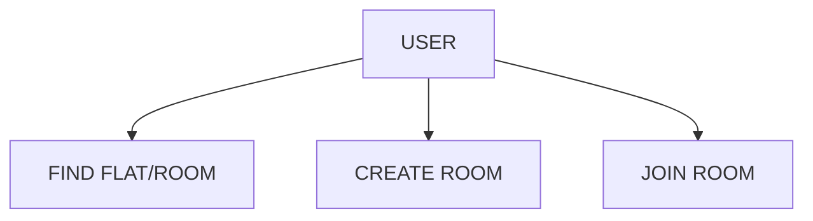
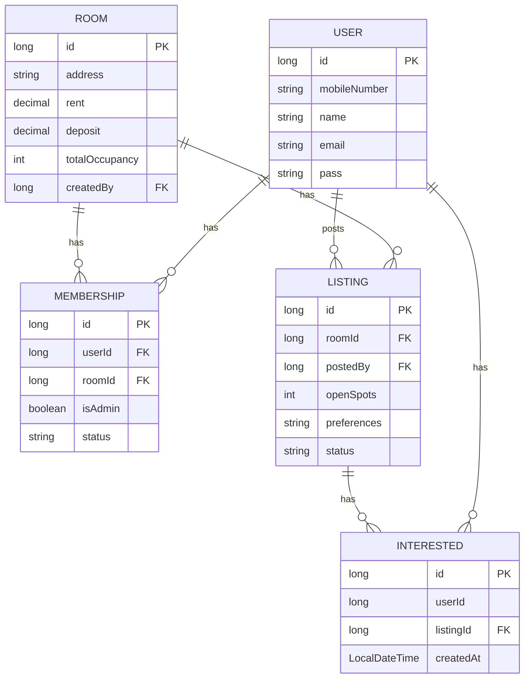
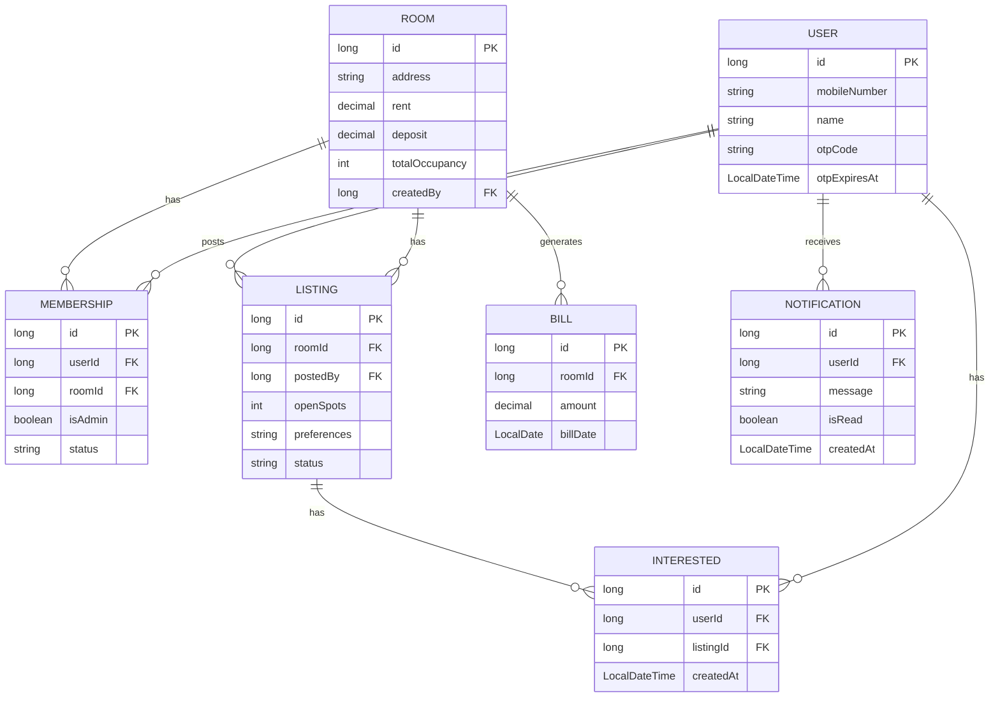
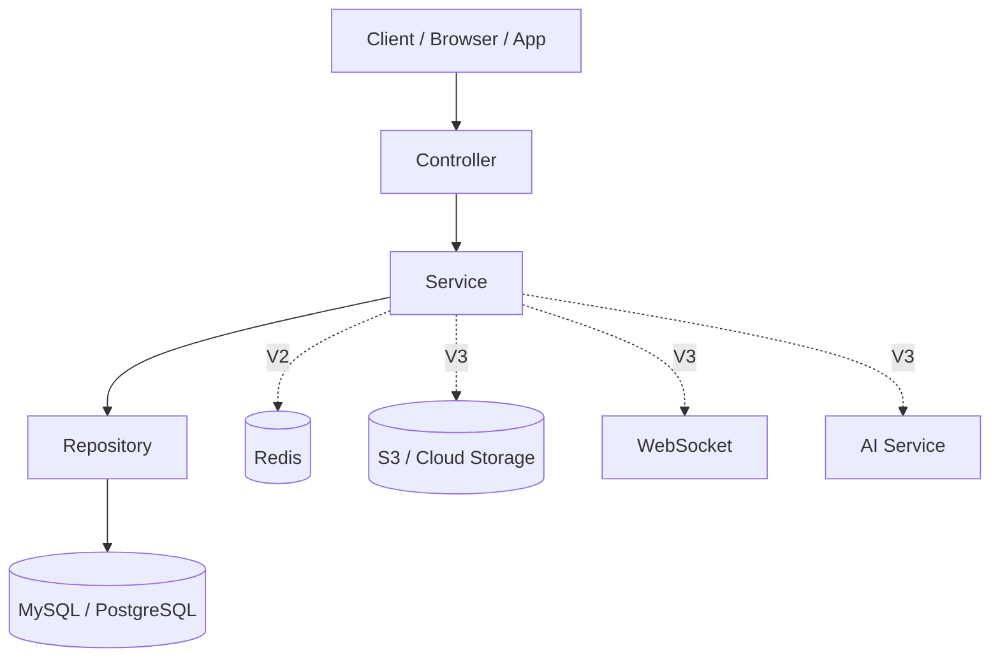
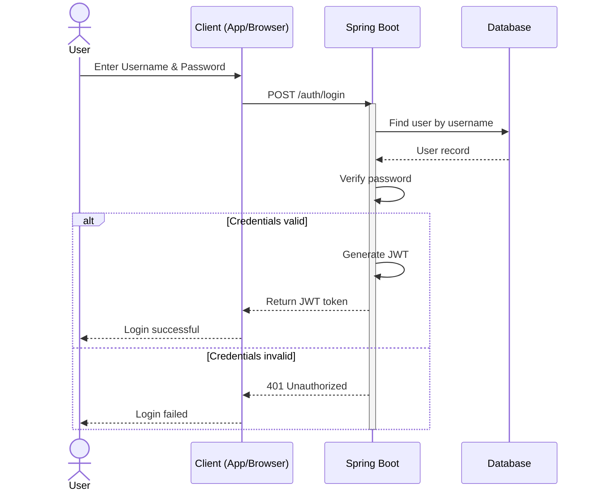
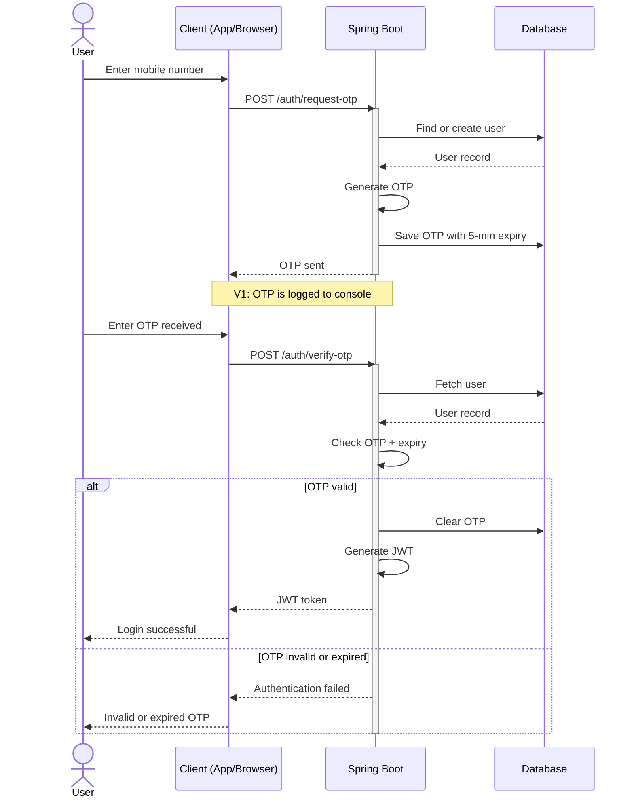
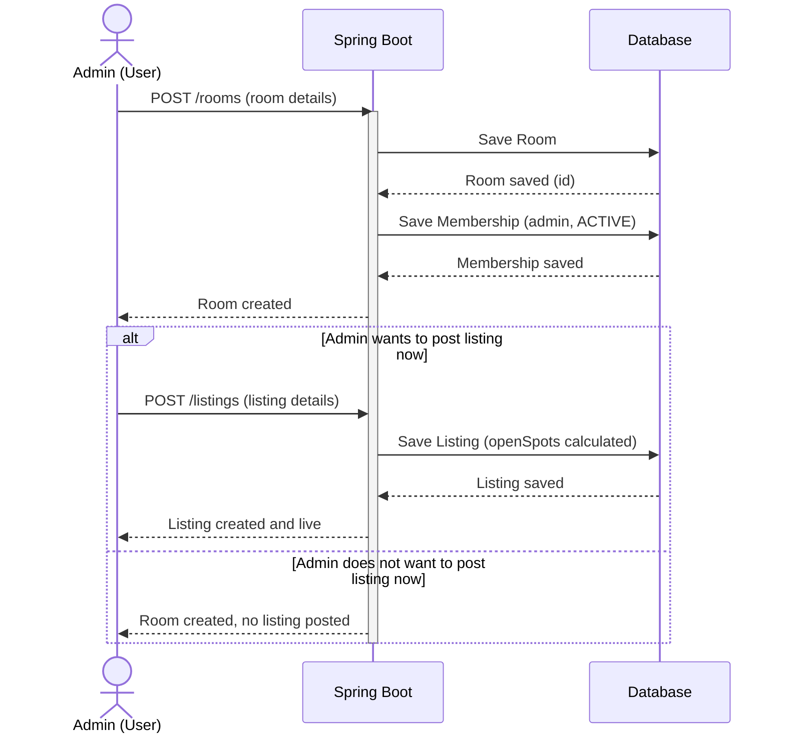

How is the system actually put together, right now
# Architecture

*How the system is actually put together, right now.*


so the aplication we built in 3 stage where we keep 3 versions
## Tech Stack by Version 


| Item | Version | Why here |
|---|---|---|
| Java 17/21 | V1 | Foundation, never changes |
| Spring Boot | V1 | Foundation |
| Spring Security | V1 | Core auth, needed from day 1 |
| JWT | V1 | Primary authentication mechanism |
| JPA / Hibernate | V1 | Data layer foundation |
| MySQL / PostgreSQL | V1 | Core database |
| REST API | V1 | The whole app is built on this |
| Swagger / OpenAPI | V1 | Cheap to add, document as you build |
| JUnit + Mockito | V1 | Unit tests on your core state-machine logic |
| Global Exception Handling | V1 | Foundational quality, not an extra |
| Validation | V1 | Foundational quality |
| Pagination + Sorting + Filtering | V1 | Needed on your room catalog/browse endpoint from the start |
| Logging | V1 | Foundational, near-zero extra effort |
| Docker | V1 | Single-container deploy |
| Cloud Deployment | V1 → V3 | Basic AWS/Oracle deploy from V1; stays constant through every version |
| File/Image Upload | V1 → V3 | V1: basic upload endpoint, image as URL. V3: matures into full Storage Bucket (S3/Oracle Object Storage) |
| OAuth2 | V2 | Adds Google/social login on top of your working JWT auth |
| Redis | V2 | Caching + OTP/session store — earns its place once the core app works |
| Integration Testing | V2 | Testcontainers-style tests against a real DB, once core logic is stable |
| Docker Compose | V2 | Multi-container orchestration (app + db + redis) |
| Audit Trail | V2 | Matters once bill-tracking and membership history are live and worth auditing |
| Live Chat (WebSocket) | V3 | Your plan |
| AI Room Recommendation | V3 | Your plan |
V1 = username/password
V2 = OTP/Email Based

## Core User Flow




\
\
\

## ER Diagram 
### version 1.1

Entities: User, Room, Membership, Listing, Interested, 




## ER Diagram 
### version 1.2

Entities: User, Room, Membership, Listing, Interested, Bill, Notification.




## System Diagram

Client → Controller → Service → Repository → DB. Redis (V2) and S3/WebSocket/AI (V3) plug into the Service layer once they're built shown dashed since they aren't part of V1.



## Package / Module Structure

Layer-based structure — kept simple since there's no microservices split yet and the entity count is still small:

```
config/
security/
controller/
entity/
enums/
dto/
service/
repository/
exception/
```


| Package | Job |
|---|---|
| `controller/` | Receives HTTP requests, validates input shape — zero business logic |
| `service/` | All business rules live here occupancy math, status transitions, admin checks |
| `repository/` | Talks to the database only, via Spring Data JPA interfaces |
| `entity/` | Maps to database tables — never returned directly to the frontend |
| `dto/` | The shapes that actually cross the network, in and out |
| `exception/` | One `@ControllerAdvice` class handling errors for every controller |


# System Login FLow 

### Version 1.1





### Version 1.2




## "how a Join Room request moves through the layers"
## Request Flow: Admin Creates Room




## Request Flow: Join Room → Admin Approval

1. **Searcher requests to join** — `POST /listings/{id}/join-request`. `JwtFilter` has already run; `SecurityContextHolder` holds the searcher's `userId`.
2. **Service layer** (`MembershipService.requestToJoin`) fetches the Listing and its Room, checks the user has no existing PENDING/ACTIVE membership elsewhere, creates a `Membership` with `isAdmin = false, status = PENDING`, and notifies the room's admin.
3. **Admin reviews** — `GET /rooms/{id}/join-requests` filters Membership by `roomId` + `status = PENDING`.
4. **Admin approves** — `POST /memberships/{id}/approve`. Authorization check: `room.createdBy.id == adminUserId`. Flips status `PENDING → ACTIVE`, notifies the new member.
5. **Result** — the new member now appears in `GET /rooms/{id}/members`, and their own `GET /users/me` reflects Member instead of Searcher.

## Request Flow: Exit Room (self-service)

1. **Member taps "Leave Room"** — `POST /rooms/{id}/exit`. `userId` comes from context only — no target-user parameter, since you can only exit for yourself.
2. **Service layer**, wrapped in `@Transactional` — finds this user's ACTIVE Membership, sets `status = LEFT`, recalculates open spots, auto-creates a new OPEN Listing if none currently exists, notifies the admin.
3. **Immediate effect** — no approval step. The freed spot appears in `GET /listings` for other searchers right away.

Join Room is *negotiated* (two requests, two users, a PENDING state in between). Exit Room is *unilateral* (one request, done instantly). Every other flow in the app is a variation of one of these two shapes.

## API Endpoints — V1


# Version 1.2 API EndPoint  List

| Category                  | Method | Endpoint                          | What it does                                                     |
| ------------------------- | ------ | --------------------------------- | ---------------------------------------------------------------- |
| **Auth**                  | POST   | `/auth/login`                     | Authenticate with username + password and return JWT  
| **Auth**                  | POST   | `/auth/Signin`                     | Authenticate with username + password and return JWT            |
| **Browse (Searcher)**     | GET    | `/listings`                       | Get all OPEN listings, paginated/filtered by location and budget |
|                           | GET    | `/listings/{id}`                  | Get single listing details                                       |
|                           | POST   | `/listings/{id}/interest`         | Mark interest → notify listing admin                             |
|                           | DELETE | `/listings/{id}/interest`         | Remove interest                                                  |
|                           | POST   | `/listings/{id}/join-request`     | Request to join → creates PENDING Membership                     |
| **Room creation** | POST | `/rooms` | Create Room + ACTIVE admin Membership. Listing is optional and can be created separately. |
|                           | GET    | `/rooms/{id}`                     | Get room details: address, rent, deposit, occupancy, etc.        |
|                           | PUT    | `/rooms/{id}`                     | Edit room details — admin only                                   |
|                           | PUT    | `/rooms/{id}/occupancy`           | Change total occupancy — admin only → opens new Listing          |
| **Listing** | POST | `/listings` | Create a listing for a room when the room admin chooses to post it. |
| **Membership management** | GET    | `/rooms/{id}/members`             | List current members, separated into admin/member                |
|                           | GET    | `/rooms/{id}/join-requests`       | Admin views PENDING join requests                                |
|                           | POST   | `/memberships/{id}/approve`       | Approve request → PENDING → ACTIVE                               |
|                           | POST   | `/memberships/{id}/reject`        | Reject PENDING request                                           |
|                           | POST   | `/rooms/{id}/exit`                | Member exits room → own Membership → LEFT                        |
|                           | DELETE | `/rooms/{id}/members/{userId}`    | Admin removes a member                                           |
| **Replacement**           | POST   | `/rooms/{id}/replacement-listing` | Leaving member creates their own replacement listing             |
| **Billing**               | POST   | `/rooms/{id}/bills/generate`      | Manually generate bill and split across ACTIVE members           |
|                           | GET    | `/rooms/{id}/bills`               | Get room bill history                                            |
| **Notifications**         | GET    | `/notifications`                  | Get current user's notifications                                 |
|                           | PUT    | `/notifications/{id}/read`        | Mark notification as read                                        |
| **Profile**               | GET    | `/users/me`                       | Get own profile + derived current role/room                      |


# Version 1.2 API EndPoint


| Category          | Endpoint                           | What it does                                                                                                                                                                                                 |
| ----------------- | ---------------------------------- | ------------------------------------------------------------------------------------------------------------------------------------------------------------------------------------------------------------ |
| **Auth (OAuth2)** | `GET /oauth2/authorization/google` | Spring Security handles this automatically — starts the Google login redirect. You don't implement this controller route.                                                                                    |
|                   | `GET /login/oauth2/code/google`    | OAuth2 callback handled by Spring Security. Your success handler looks up/creates the User by email and issues your own JWT.                                                                                 |
|                   | `POST /auth/logout`                | Logs out the current user by invalidating/revoking their JWT. **This requires a server-side token revocation/blacklist mechanism; a stateless JWT by itself cannot literally be invalidated before expiry.** |
| **Room History**  | `GET /rooms/{id}/history`          | Returns complete membership history for the room — users who joined, left, were removed, etc., with relevant dates/status changes.                                                                           |
